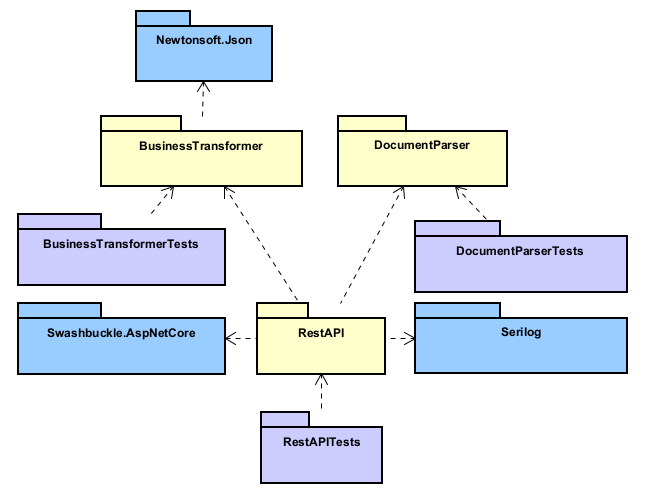

# INTERNAL-SOURCE-TRANSFORM
## Description
This is a .NET 8 solution, designed to be a microservice in an ETL software.

This is the **transformation** part of a SBB CFF FFS app. There are four distinct parts to this solution :

- The **Restfull API** served with ASP.net core (contains only controllers)
- **Common interfaces** : Contains only interfaces for communication between the two main parts
- **Raw format conversion** (from text extracted from a PDF) and associated test project :
  - Core maintainer : Cyprien Jaquier
- **Business transformation / computation** of what was returned by the text parser and associated test project :
  - Core maintainer : Eliott Jaquier

## Getting Started

### Prerequisites
* IDE: JetBrains Rider 2024.2+ [Download](https://www.jetbrains.com/rider/download/)
* .NET SDK 8.0+ [Download](https://dotnet.microsoft.com/download)
* Git version 2.39+ [Download](https://git-scm.com/)
* Git LFS 3.5+ [Download](https://git-lfs.github.com/)
* Astah UML 8.4+ [Download](https://astah.net/products/astah-uml/)

### Getting started
#### Build the project:
```shell
dotnet restore
dotnet build
```

#### Run the api locally
```shell
cd RestAPI
dotnet run
```
You can go to [http://localhost:5067/swagger/](http://localhost:5067/swagger/index.html) to see API endpoints.

#### Test projects:
```shell
cd BusinessTransformerTests
```
OR
```shell
cd DocumentParserTests
```
And then
```shell
dotnet test
```

## Collaborate

### Directory Structure
```shell
├───.idea                      // Project metadata for Rider configuration
├── .gitignore                 // Git ignore rules
├───Doc                        // Project documentation in markdown
├───CommonInterfaces           // Some interfaces and structures every part of the project should use (no logic inside)
├───BusinessTransformer        // Core logic for business transformation and computation
├───BusinessTransformerTests   // NUnit3 tests for BusinessTransformer
├───DocumentParser             // Handles raw format conversion from PDF-extracted text
├───DocumentParserTests        // NUnit3 tests for DocumentParser
├───RestAPI                    // RESTful API using ASP.NET Core, contains only controllers
├───RestAPITests               // Contains ent to end tests of RESTful API using ASP.NET Core
├── LICENSE.txt                // MIT License for the project
├── README.md                  // Project overview and usage instructions
```

### General Architecture
The project is divided into four parts: CommonInterfaces, BusinessTransformer, DocumentParser, and RestAPI.
Here is the dependency graph (exported image of astah uml) of the project:

We have 3 layers in the project: 
 - The common interfaces for all project parts
 - Standalone models layers (like the document parser or the business transformer)
 - The RestAPI, with controllers, using all models and interfaces.

For model layers, we have tests projects that test the implementation of the interfaces (unit and integration tests).

For the RestAPI, we have end-to-end tests that test the API endpoints.

It is impossible to have a circular dependency between the projects (this generally implies a bad design).

For more information, see the [UML diagrams](Doc/UML.asta) and the main [Technologies documentation](Doc/Technologies.md) used in the project.
### Class syntax
Classes and code structure follow the [Microsoft C# Coding Conventions](https://learn.microsoft.com/en-us/dotnet/csharp/fundamentals/coding-style/coding-conventions).

### Workflow
* [How to commit](https://www.conventionalcommits.org/en/v1.0.0/)
* Pull requests are open to merge in the develop branch.
* Feature branches are created from the develop branch and merged back into it. 
  * We use the [Gitflow Workflow](https://www.atlassian.com/git/tutorials/comparing-workflows/gitflow-workflow).
  * The name of a feature branch should be `feature/feature_branch` in snake case.

## License
Distributed under the MIT License. See LICENSE.txt for more information.

## Contact
* If needed you can create an issue on GitHub we will try to respond as quickly as possible.
